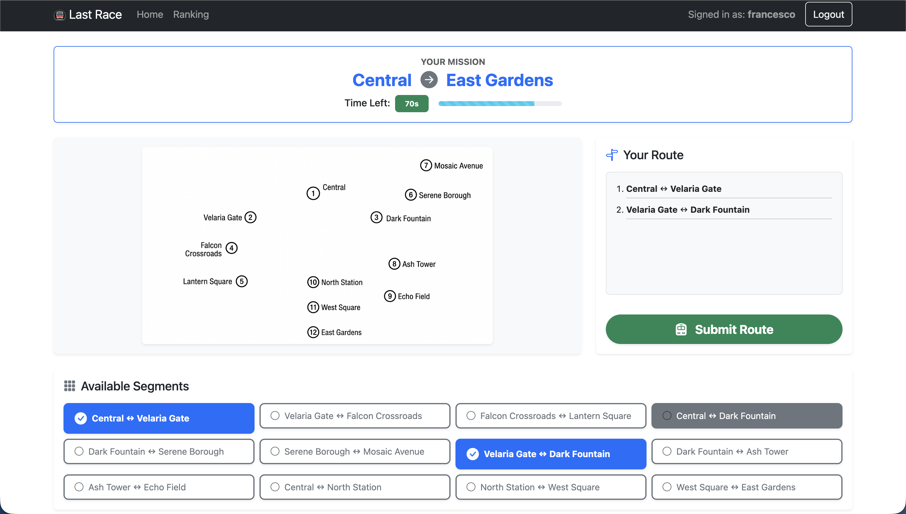
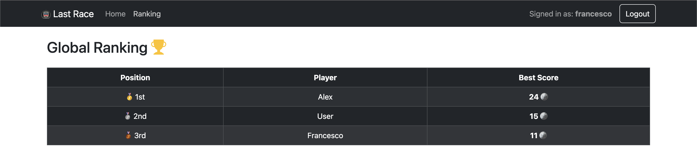

# Exam #1: "Last Race"
## Student: s361442 Fanci Francesco Paolo 

## React Client Application Routes

- Route `/`: Home page of the application. If the user is not logged in, it shows a welcome message and instructions. If logged in, it renders the `GameArea` component to start playing the game (Setup, Planning, Execution, and Result phases).
- Route `/login`: Renders the `LoginForm` component to allow users to authenticate. If already logged in, it redirects to `/`.
- Route `/ranking`: Protected route that renders the `Ranking` component. It displays the global leaderboard showing the best score for each player. Redirects to `/login` if unauthenticated.
- Route `*`: Fallback route for 404 Page Not Found.

## API Server

### Authentication APIs

- **POST `/api/sessions`**
  - Authenticates a user.
  - **Request body:** JSON object containing `username` and `password`.
  - **Response:** `200 OK` (success) with user details `{"id": 1, "username": "mario"}`, or `401 Unauthorized` (failure).
  
- **GET `/api/sessions/current`**
  - Checks if the user is currently logged in.
  - **Response:** `200 OK` (success) with user details if authenticated, or `401 Unauthorized` (failure) if not.

- **DELETE `/api/sessions/current`**
  - Logs out the current user.
  - **Response:** `200 OK` (success).

## Database Tables

- Table `users` - contains the registered users. Columns: `id`, `username`, `salt`, `password` (hashed with scrypt).
- Table `stations` - contains all the subway stations. Columns: `id`, `name`, `is_interchange`.
- Table `lines` - contains the subway lines. Columns: `id`, `name`.
- Table `segments` - contains the connections between stations. Columns: `id`, `station_a_id`, `station_b_id`, `line_id`.
- Table `events` - contains the random events and their effect on coins. Columns: `id`, `description`, `effect`.
- Table `games` - contains the history of the games played. Columns: `id`, `user_id`, `score`, `date`.

## Main React Components

- `NavHeader` (in `NavHeader.jsx`): Renders the top navigation bar with links to the Home/Map and Ranking. It also displays the user greeting and the Logout button if authenticated.
- `LoginForm` (in `LoginForm.jsx`): Renders the login form with username and password fields.
- `GameArea` (in `GameArea.jsx`): The core component of the app. It acts as a State Machine managing the game phases (`SETUP`, `PLANNING`, `EXECUTION`, `RESULT`) and stores the downloaded network data.
- `PlanningPhase` (in `PlanningPhase.jsx`): Shows the assigned mission (Start -> Dest), manages the 90-seconds countdown timer, and allows the user to click and build their route segment by segment.
- `ExecutionPhase` (in `ExecutionPhase.jsx`): Validates the submitted route (checks continuity, duplication, and legal line transfers). If valid, it iterates through the segments triggering random events step-by-step and updating the coin stash.
- `ResultPhase` (in `ResultPhase.jsx`): Displays the final outcome (Game Over / Success), the final score, and a button to Play Again.
- `Ranking` (in `Ranking.jsx`): Fetches and displays the global leaderboard in a Bootstrap Table.

## Screenshot

**Game Page:**

**General Ranking Page:**

## Users Credentials

Here are the test users pre-configured in the database:

- `user`, password: `password`
- `alex`, password: `password123`
- `francesco`, password: `abc123password`

## Use of AI Tools

- Clarifying and better defining the application's objectives and logic.
- Creatively generating the game content (e.g., station names and random events).
- Providing support and resolving errors (debugging) during code development.